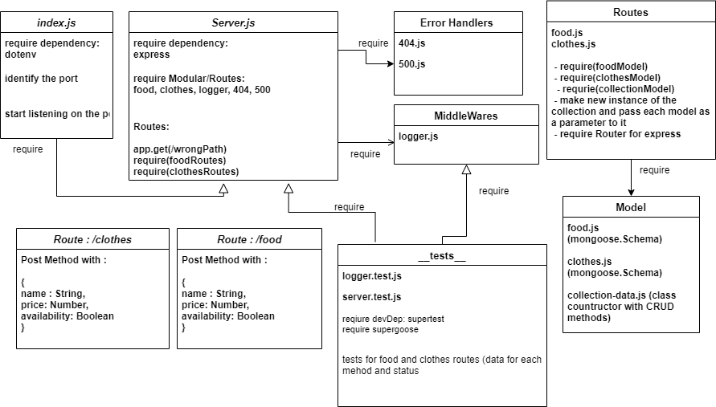

# api-server

### Deployment Test

Author: Nihad Zeidan

### tests report

[Heroku Clothes](https://nihad-api-server.herokuapp.com/clothes)

[Heroku Food](https://nihad-api-server.herokuapp.com/food)

[GitHub PR](https://github.com/NihadZeidan/api-server/pull/1)

[GitHub PR after Edits](https://github.com/NihadZeidan/api-server/pull/3)

[GitHub Actions](https://github.com/NihadZeidan/api-server/actions)

### .env requirements

PORT - Port Number

MONGODB_URI=mongodb://localhost:27017/lab04

### Running the app

`npm start`

### Endpoints: 

`/clothes` and `/food` 

### Input Objects

{
    `name: { type: String, required: true },`

   `price: { type: String, required: true },`

  `availability: { type: Boolean, required: true }`
}

### Tests

Unit Tests: `npm test`

UML

